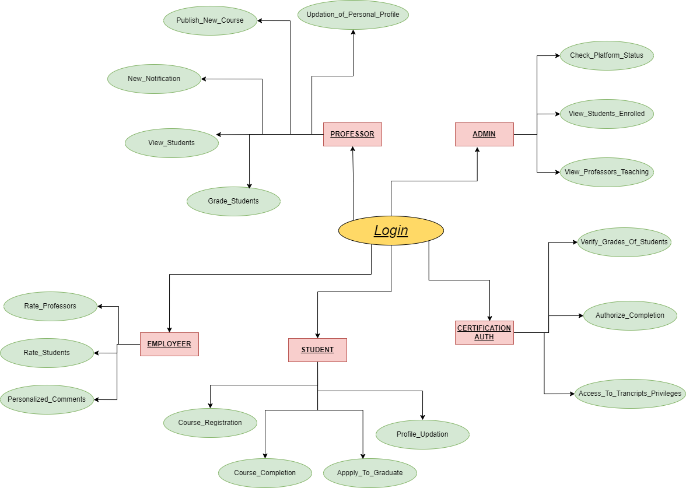
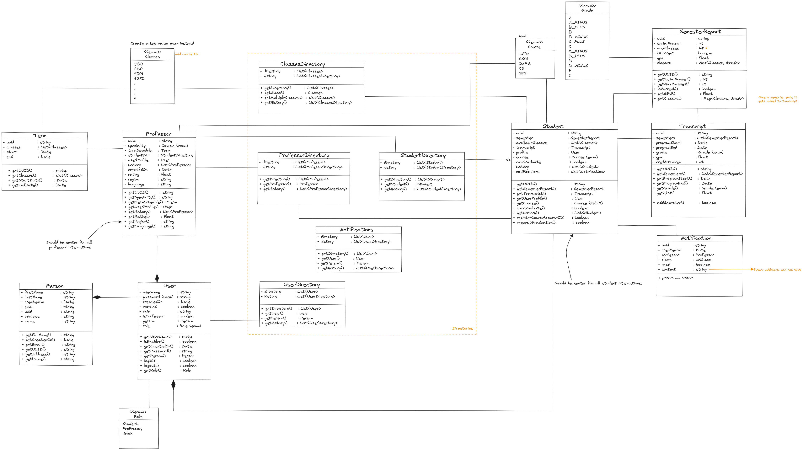

*<h1><ins>DIGITAL EDUCATION PLATFORM (DigitalEDHub) </ins></h1>*

*“**DigitalEDHub**”* is our dynamic ecosystem of Digital Education Platforms where professors, students, employers, and transcript authorities can converge to create a vibrant and easily accessible education network. In DigitalEDHub, students have access to quality education and they can even interact with professors for guidance. Employers can rate the professors as well as the students helping to have a scope to improve the whole platform with a competitive environment. The transcript authority ensures the integrity of educational records between the students, fostering trust and reliability in the platform. Altogether, this is the interconnected community including various roles that cultivate an environment of learning collaboration, and career advancements, making our platform comprehensive and holistic for education and professional growth.  

For our Digital Education Platform, we have defined five roles and the functionalities they have are:

1. <ins>Student:</ins> 
- Students play a central role in our DigitalEDHub. They have a total of 5 functionalities under them:-
- **Edit Profile -** They can view and update their profile which consists of NUID, Full name, Contact Details, Gender, Age, and Address. Once they update their profile details, they can save these details. 
- **My learning -** Here, students can track their progress such as Enrolled Courses, Grades, Course ID, and Semester. Students have the ability here to Drop and Complete a particular course. They can view their grades on a 4-point rating system on this panel, which is updated by the instructor for that specific course. Once they have completed a minimum of 8 courses in 4 semesters, then only they can graduate. 
- **Browse Courses -** Students can browse the courses that they want to pursue with their respective professors. Here they can view the professor for that course, their rating, and the class timings that the professor has updated. 
- **Notification -** This panel shows all the messages that are updated by the professor as a notification. 
- **View Transcript -** Once the transcript authority has approved the graduation, students can view their transcripts on this panel.

2. <ins>Professor:</ins>
- Professor has a total of 3 functionalities under them:-
- **My Term Schedule -** The professor can select a course and then update the time of the classes as well from this panel. Once the course selection is done, the professor can publish the course, and this published course goes into the student panel so that students can enroll for the particular course. For the course he selects, he can also notify students regarding the course requirements. This notification goes to the Notification panel of the Student.
- **Enrolled Students -** Here, the professor can see the enrolled students, and their ID and also give the grades for that particular course.
- **Edit Profile -** The professor can edit his profile from this panel. He can even update his profile and then save it.

3. <ins>Admin:</ins> 
- **My Profile -** The admin can view his/her profile in this panel. They can edit, view, and then save the updated information here.
- **View all Students -** Admin can view all the students here with the particular enrolled course and with their grades. 
- **View all Professors-** Admin can view all the professors here with the subjects they teach and offer to students. They also can view the professor rating which is being given by the employer and the number of students enrolled in a particular course under a particular professor. 

4. <ins>Certification Authority/Transcript:</ins>
- This role can view the Student Name, GPA, Completed Credits, Student ID, and Graduate button. It is capable of accepting the student's graduation request. The request is accepted after an assessment of the student's grades and completed semesters, ensuring that the student with all requirements fulfilled is permitted to access the transcripts which ensures that the platform's integrity of records & genuineness is maintained.

5. <ins>Employer:</ins>
- **Role -** The role has the authority to rate and comment on professors and students.
- **Effect -** These ratings can also be revised. These comments also assist students in determining which course professor has high ratings and is worth pursuing that course under his guidance. It also assists students in understanding how much they need to improve in this digital education platform in comparison to other students based on their ratings.
  

### Use cases
- [x] System startup with all the initial configurations all worked out. These include a universal student directory, and a universal certification authority to say if a student is ready to graduate. A student is ready to graduate with an MS degree if they take 8 courses max. A directory of available courses and associated search capabilities will be in place to serve students.
- [x] A professor can sign up for the service and then able to manage their course catalog (1 or 2 courses) and semester-based course schedules.
- [x] Students would sign up to use the system. A transcript is created accordingly.
- [x] Professors create a course schedule every term with the courses they plan to offer for that term.
- [x] Students browse the courses that are available from any professor anywhere in the world. They can search by professor name, topic, region, language, etc.
- [x] Students decide to register for classes. They will search for topics and register for the courses they want to take. They should be able to see the professor's rating before they register.
- [x] Students declare they want to graduate. The platform would review their transcript and indicate if the student satisfies graduation requirements.
- [x] A dashboard that enables platform owners to collect performance data of different varieties.

#### Extra use cases or features:
- [x] Notification - The professor can send announcements to all the students and students can view them and take action accordingly.
- [x] Employer - The role employee can rate the professors and students.
- [x] Employer Engagement - The employee maintains his personal notepad where he or she can note down the feedback regarding a student or a professor which can help them in the future to make decisions based on the feedback they wrote.
- [x] Transcript - A student can download his/her transcript as an Image - png in the desired location they wish. They will get approved for this transcript by the Certification Authority or the transcript authority.

#### Architecture Daigram -->

