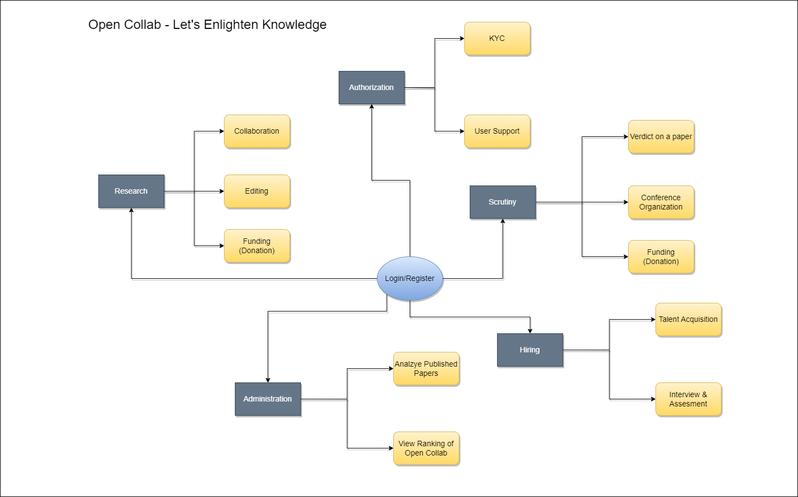

*<h1><ins>OpenCollab - Research Collaboration Platform</ins></h1>*

*<ins>Aim:</ins>*    
We aim to establish an Open Collab which is a dynamic research collaboration platform designed to empower young researchers by facilitating seamless collaboration with peers across diverse domains. The platform fosters the creation of high-quality research papers, offering a cost-free avenue for publication. 

*<h4><ins>Key Roles:</ins></h4>*   

1. Researcher (User):
- Engage in collaborative research projects.
- Build a rating index based on performance.
- Explore opportunities aligned with personal interests.

2. Hiring Employer:
- Assess researchers based on their rating index.
- Hire researchers for specific projects.
- Assign projects in the researcher's domain of interest.
  
3. Scrutiny Team:
- Review and analyze project submissions.
- Ensure adherence to quality standards.
- Provide constructive feedback to researchers.
  
4. Feedback Team:
- Facilitate communication between team members.
- Share valuable insights and information.
- Enhance the collaborative research experience.
  
5. Auth Team:
- Verify researcher accounts through email.
- Implement a secure PIN sharing system.
- Ensure the authenticity of user accounts.

*<h4><ins>How It Works:<ins></h4>*

1. User Registration:

- Researchers create accounts with email verification.
- The auth team verifies accounts for authenticity.

2. Collaboration Process:

- Researchers explore and join collaborative projects.
- Hiring employers to select researchers based on ratings.
- Scrutiny and feedback teams enhance project quality.  

3. Publication:

- Completed projects undergo scrutiny and feedback.
- High-quality research papers are published at no cost.

*<h4><ins>Getting Started:</h4></ins>*
1. Create an Account:
- Sign up as a researcher, hiring employer, or team member.

2. Explore Projects:
- Browse available projects or create one of your own.

3. Collaborate:
- Engage with your chosen team members.
- Contribute to the project and build your rating.

4. Publish Your Research:
- Submit your completed project for scrutiny.
- Receive feedback and contribute to the publication.

5. Contribution Guidelines:
- Follow the Open Collab code of conduct.
- Ensure the quality and integrity of your research.
- Collaborate respectfully with other team members.

*<h4><ins>Enterprises and Organisations:</h4></ins>* 

1. Research:
The Research enterprise is at the forefront of our commitment to advancing knowledge and innovation. Our platform provides a collaborative space for researchers to explore, ideate, and contribute to cutting-edge projects. We foster an environment that encourages interdisciplinary collaboration, empowering researchers to push the boundaries of knowledge and drive meaningful discoveries. 
- Organisations:  
a. Collaboration  
b. Editing  
c. Donation(Funding)  

2. Authority:
The Authorization enterprise plays a crucial role in ensuring the integrity and security of our collaborative platform. We implement robust authorization mechanisms to control access and permissions, safeguarding sensitive data and intellectual property. 
- Organisations:  
a. KYC  
b. User Support

3. Scrutiny: Scrutiny is central to maintaining the highest standards of quality and reliability in our research community. Our Scrutiny enterprise employs thorough examination and evaluation processes to scrutinize research outputs, ensuring accuracy, credibility, and adherence to ethical standards. 
- Organisations:  
a. Verdict on a paper  
b. Conference Organisation 

4. Hiring: The Hiring enterprise is dedicated to connecting talented individuals within the research community with opportunities that align with their expertise. Our platform serves as a bridge between researchers and organizations, facilitating seamless collaboration on projects and initiatives. Through our Hiring enterprise, researchers can discover, apply for, and contribute to a diverse range of projects, fostering professional growth and expanding their impact in the research landscape.
- Organisations:  
a. Talent Acquisition   
b. Interview and Assessment 

